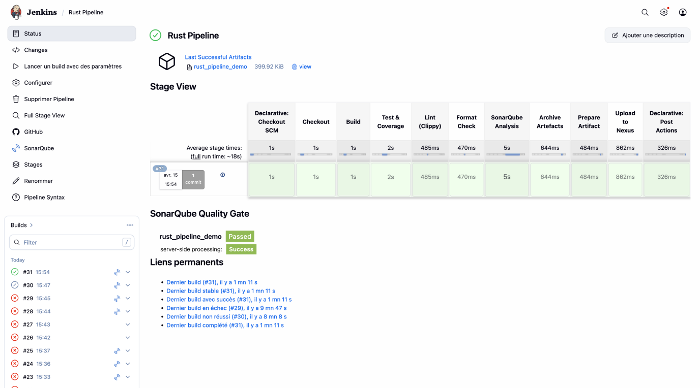
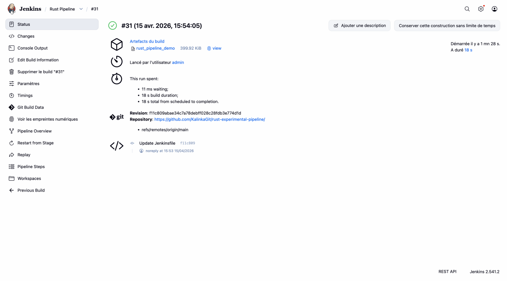
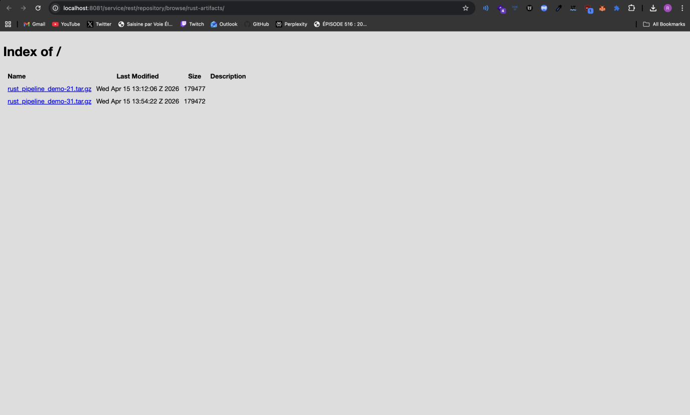
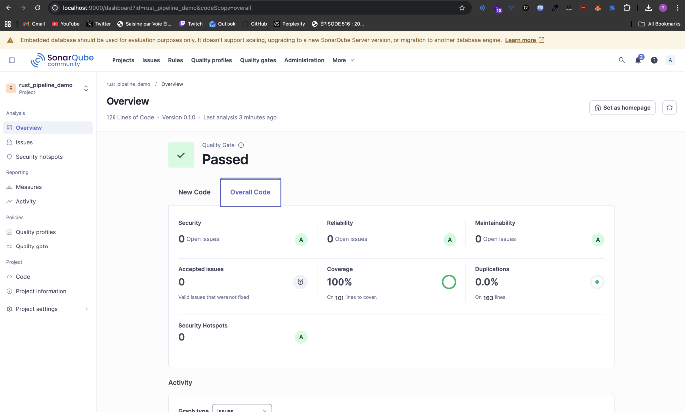

# TP1 - CI/CD avec Jenkins, SonarQube et Nexus

**Rémi Grimault - Axel JACQUET**

Projet Rust utilisé comme support pour mettre en place un pipeline CI/CD complet.

## Pipeline

Le Jenkinsfile a la racine du repo définit les étapes suivantes :

1. **Checkout** - récupération des sources
2. **Build** - compilation release avec `cargo build --release`
3. **Test & Coverage** - exécution des tests et génération du rapport de couverture (lcov + conversion XML pour SonarQube)
4. **Lint (Clippy)** - analyse statique du code Rust avec `cargo clippy`
5. **Format Check** - vérification du formatage avec `cargo fmt`
6. **SonarQube Analysis** - analyse qualité avec import du rapport de couverture
7. **Archive Artefacts** - archivage du binaire dans Jenkins
8. **Prepare Artifact** - empaquetage en `.tar.gz`
9. **Upload to Nexus** - dépôt de l'artefact sur Nexus via curl (credentials Jenkins)

## Captures

### Liste des builds et vue des stages

Vue d'ensemble du pipeline avec les temps d'exécution par stage et le résultat de la quality gate SonarQube.

### Détail d'un build

Build #31 réussi, artefact archivé (399.92 KiB), lié au commit `f11c809`.

### Artefacts dans Nexus

Les `.tar.gz` sont déposés dans le dépôt `rust-artifacts` sur Nexus (`localhost:8081/service/rest/repository/browse/rust-artifacts/`).

### Rapport SonarQube

Quality Gate : **Passed**. Couverture de tests : **100%** sur 101 lignes. Aucun bug, aucune faille de sécurité, 0 duplication.

## Extras réalisés

**Coverage sur le rapport Sonar** : le stage `Test & Coverage` utilise `cargo-llvm-cov` pour générer un fichier `lcov.info`, converti en `coverage.xml` au format Sonar Generic Coverage. Ce fichier est passé au scanner via `-Dsonar.coverageReportPaths=coverage.xml`.

**Linter dans Jenkins** : le stage `Lint (Clippy)` exécute `cargo clippy -- -D warnings`, ce qui fait échouer le build si Clippy remonte le moindre avertissement. Un stage `Format Check` complémentaire vérifie le formatage avec `cargo fmt -- --check`.

**Credentials Binding** : le stage `Upload to Nexus` utilise `withCredentials` pour injecter l'identifiant et le mot de passe Nexus sans les exposer dans les logs.
